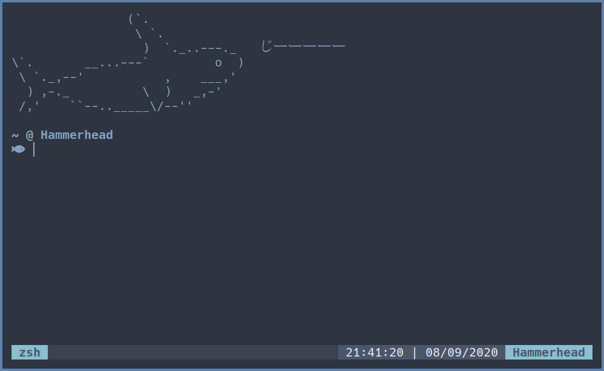

st - simple terminal
--------------------
st is a simple terminal emulator for X which sucks less. This is my build of st with patches that make my life a bit easier and the style that I liked (Nord Theme).

Requirements
------------
In order to build st you need the Xlib header files. All required fonts (font names can be found in `config.def.h`)

Installation
------------

Clone this repository and run `sudo make clean install` to build it. Now you can run st.

Credits
-------
Based on Aurélien APTEL <aurelien dot aptel at gmail dot com> bt source code.

